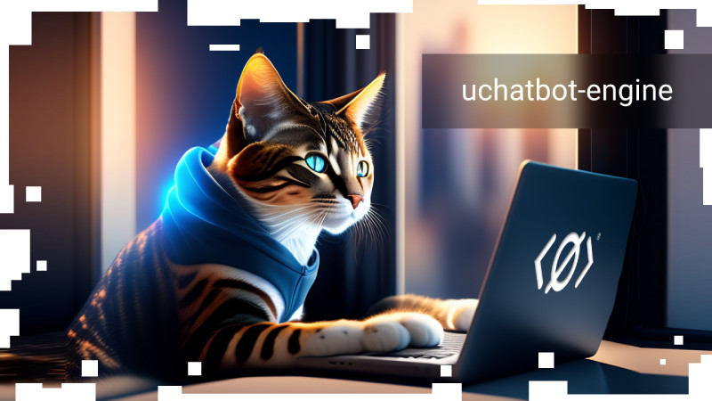

Engine for creating chatbots for Utopia Messenger

## Concept

You don't want to understand Utopia API, but you have an idea how to make a bot that works with users in private and public messages.

The engine can:

1. process messages from contacts;
2. process messages in channels (private & public messages);
3. automatically logs into channels, can use the password for closed channels.

## Using the engine

1. Chatbots that raise and retain user activity in channels.
2. Bots for performing services to users.
3. Creating a bot constructor.

## Install

```bash
go get github.com/Sagleft/uchatbot-engine
```

## Example

```go
package main

import (
	"fmt"
	"log"

	"github.com/Sagleft/uchatbot-engine"
	utopiago "github.com/Sagleft/utopialib-go/v2"
	"github.com/Sagleft/utopialib-go/v2/pkg/structs"
	"github.com/fatih/color"
)

const APIToken = "your-utopia-api-token"

func main() {
	_, err := uchatbot.NewChatBot(uchatbot.ChatBotData{
		Config: utopiago.Config{
			Host:   "127.0.0.1",
			Token:  APIToken,
			Port:   20000,
			WsPort: 25000,
		},
		Chats: []uchatbot.Chat{
			{ID: "D53B4431FD604E2F0261792444797AA4"},
			{ID: "A59D8B62E1A59049564A4B0F8B457D45"},
		},
		Callbacks: uchatbot.ChatBotCallbacks{
			OnContactMessage:        OnContactMessage,
			OnChannelMessage:        OnChannelMessage,
			OnPrivateChannelMessage: OnPrivateChannelMessage,

			WelcomeMessage: OnWelcomeMessage,
		},
		UseErrorCallback: true,
		ErrorCallback:    onError,
	})
	if err != nil {
		log.Fatalln(err)
	}
}

func OnContactMessage(m structs.InstantMessage) {
	fmt.Printf("[CONTACT] %s: %s\n", m.Nick, m.Text)
}

func OnChannelMessage(m structs.WsChannelMessage) {
	fmt.Printf("[CHANNEL] %s: %s\n", m.Nick, m.Text)
}

func OnPrivateChannelMessage(m structs.WsChannelMessage) {
	fmt.Printf("[PRIVATE] %s: %s\n", m.Nick, m.Text)
}

func OnWelcomeMessage(userPubkey string) string {
	return fmt.Sprintf("Hello! Your pubkey is %s", userPubkey)
}

func onError(err error) {
	color.Red(err.Error())
}

```
